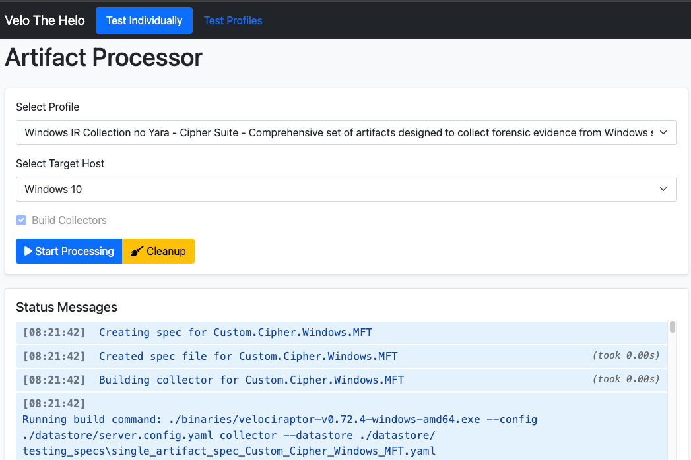
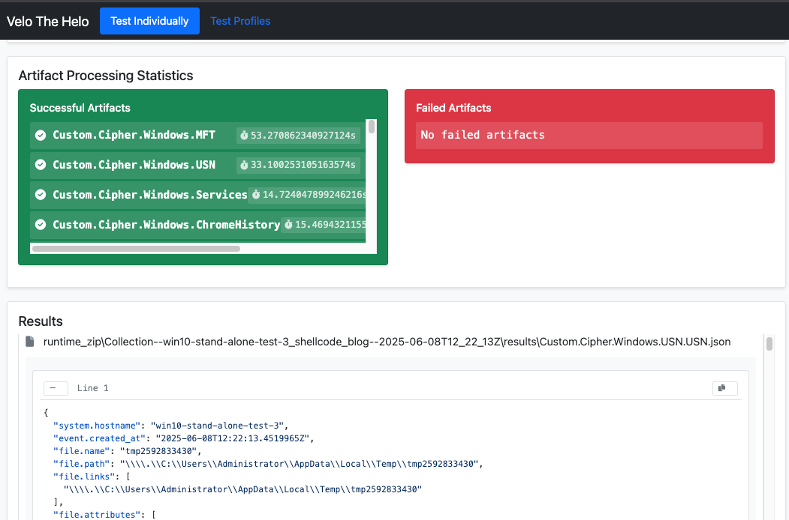

# Velociraptor Collector Manager

This is a development and testing platform. It makes working with Velociraptor artifacts way less painful. It helps you test, validate, and deploy artifacts without losing your mind.

Traditional methods of testing artifacts one by one through the Velociraptor GUI or command line can be time-consuming and error-prone. This platform streamlines the process by providing a structured environment where artifacts can be systematically tested, validated, and managed with version control.

The "Individual Testing" tab allows you to focus on single artifacts during development or troubleshooting. This is particularly useful when you're creating new artifacts, debugging collection issues, or fine-tuning artifact parameters. For example, you can test a Windows Registry artifact in isolation to ensure it correctly collects the intended keys, or verify that a file system artifact properly handles different path conditions and permissions. The platform ensures your artifacts work reliably across different Windows versions (7, 11, Server 2012, 2022, etc.), service pack levels, and system configurations, helping you identify compatibility issues before deployment.

The "Profile Testing" tab enables you to validate groups of artifacts that are commonly used together for specific investigation scenarios. For example, you can create and test profiles for IR investigations, CA engagements..etc. This helps with workflows where multiple artifacts need to work together seamlessly. Testing artifacts in combination rather than individually helps identify resource conflicts, timing issues, and dependencies between artifacts that wouldn't be apparent when testing them separately. 


#### The deployment windows:



#### Status  of executions + the first two lines of each output file:




## What's the Point?

- **Test Your Artifacts**: Make sure they work across different OS versions before you deploy them
- **Team Stuff**: Pull artifacts from a central server so everyone's on the same page
- **Profile Management**: Create and test reliable artifact combinations
- **Automation FTW**: Stop doing repetitive tasks manually

## What Can It Do?

1. Build and deploy collectors
2. Run collections remotely
3. Process and standardize data
4. Add system info and timestamps
5. Make sure everything's formatted nicely

## Testing Approaches

### Individual Testing vs Profiles

#### Individual Testing 

Benefits for developers:
- Allows you to find which ones hangs forever
- Clearer error messages for the specific artifact
- Easier to debug and trace issues
- Lets you focus on one artifact's behavior at a time

#### Profile Testing 
Benefits for developers:
- Tests how artifacts interact with each other
- Validates resource usage when running multiple collectors
- Ensures artifacts don't conflict or interfere
- Better represents real-world deployment scenarios
- Perfect for final testing before production

## Project Structure

```
runtime/      -> Temp storage for collection data
runtime_zip/  -> Processed results
collectors/   -> Built Velociraptor collectors
specs/        -> Artifact specs (YAML)
binaries/     -> Velociraptor executables
config/       -> Config files
```

## Getting Started

### Web Interface
```bash
python web_interface.py --ssl
```

Visit https://localhost:5000 and you're good to go.

### Command Line

The collector manager supports several modes and options:

```bash
python collector_manager.py --mode [mode] [options]
```

#### Available Modes
- `batch`: Process multiple artifacts at once
- `individual`: Process one artifact at a time
- `windows_test`: Test Windows connectivity
- `process_zip`: Process collection ZIP files

#### Basic Examples

```bash
# Process ZIP files from default runtime directory
python collector_manager.py --mode process_zip

# Process ZIP files from custom directory
python collector_manager.py --mode process_zip --input-dir "C:\collections" --output-dir "C:\results"

# Process specific artifacts
python collector_manager.py --mode batch --artifacts "Windows.System.HostsFile"

# Build and process multiple artifacts
python collector_manager.py --mode batch --artifacts "Windows.System.HostsFile,Windows.Network.NetstatEnriched" --build
```

#### Common Options
```bash
--input-dir PATH     # Input directory for ZIP files (default: runtime/)
--output-dir PATH    # Output directory for results (default: runtime_zip/)
--artifacts LIST     # Comma-separated list of artifacts
--build             # Build collectors for specified artifacts
```

## Requirements

- Python 3.x
- Windows (for collector operations)
- Some Python packages (check requirements.txt)
- For web stuff: Flask, Flask-SocketIO, Werkzeug, eventlet

## Config

### Web Interface Configuration
The web interface can be configured through environment variables:
```bash
WINRM_HOST_WIN10=192.168.1.1
WINRM_HOST_WIN11=192.168.1.1
WINRM_HOST_WINServer12=192.168.1.1
WINRM_HOST_WINServer16=192.168.1.1
WINRM_HOST_WINServer19=192.168.1.1
WINRM_HOST_WINServer22=192.168.1.1
WINRM_HOST_WINServer25=192.168.1.1
WINRM_USERNAME=administrator
WINRM_PASSWORD=PASSWORDHERE
SSH_PORT=22
COLLECTOR_FILE=./datastore/Collector_velociraptor-v0.72.4-windows-amd64.exe
VELO_DATASTORE=./datastore/
VELO_SERVER_CONFIG=./datastore/server.config.yaml
VELO_BINARY_PATH=./binaries/velociraptor-v0.72.4-windows-amd64.exe
ARTIFACT_TEMPLATE_PATH=./specs/test.yaml
```

### Command Line Configuration
The command line interface uses the following default directories:
- `runtime/`: Default input directory for ZIP files
- `runtime_zip/`: Default output directory for processed files
- `collectors/`: Directory for built collectors
- `specs/`: Directory for artifact specifications

## OS Support

This is primarily a Windows tool. It might work on Linux/macOS but you'll probably need to tweak some stuff (especially those Windows-style paths).

Need help? Open an issue then try to close it yourself. I believe in you : )
